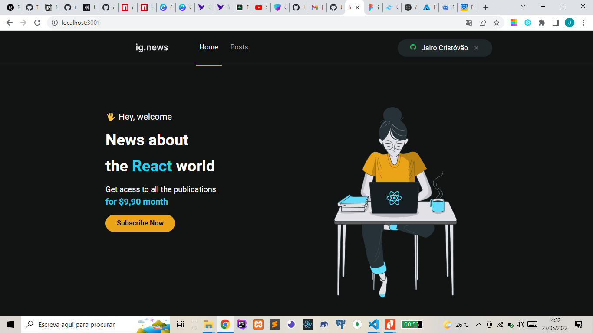
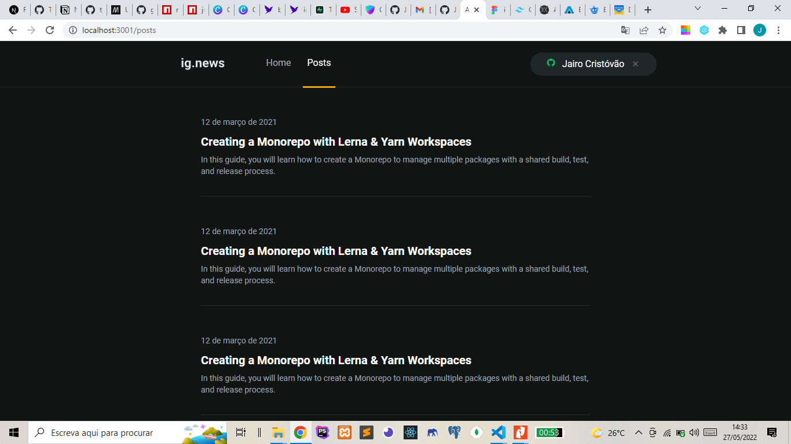
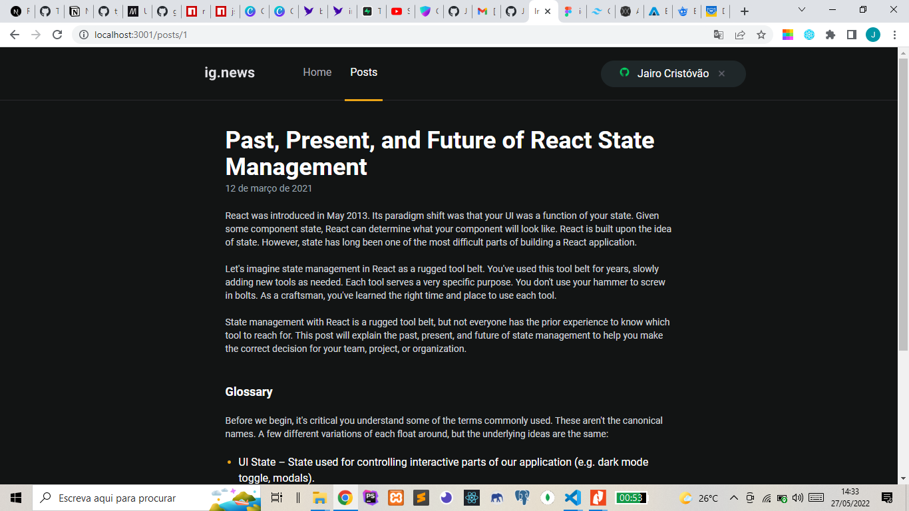

# igNews (ignews-clone)

<div id="top"></div>
<!---Esses são exemplos. Veja https://shields.io para outras pessoas ou para personalizar este conjunto de escudos. Você pode querer incluir dependências, status do projeto e informações de licença aqui--->


<details>
<summary>System Images</summary>
</br>
</br>
</br>
</details>

## About The Project

>This project was created in order to challenge me to practice more about Next.js and TailwindCss. The idea to make this project came through a project developed by Diego Fernandes diego3g CTO from RocketSeat (using Next.js and StyledComent).

Here's why:

* To improve my skills with tailwindCss;
* To improve my skills with NextAuth;
* Create something that people can come to use in their daily lives :smile:

<p align="right">(<a href="#top">back to top</a>)</p>

### Adjustments and improvements

The project is still under development and the next updates will focus on the following tasks:

* [] All interface was done;
* [] Allows you to log in with Github account;
* [] Register News;
* [] Allows you to search for a News;
* [] Allows Editing a News;
* [] Allow grouping News from a given month;

### Built With

* [Next.js](https://nextjs.org/)
* [TailwindCss](https://tailwindcss.com/)
* [heroicons](https://heroicons.com/)
* [NextAuth](https://next-auth.js.org/)
* [Firebase](https://firebase.google.com/)
* [headlessui](https://headlessui.dev)

<p align="right">(<a href="#top">back to top</a>)</p>

## Getting Started

To get a local copy up and running follow these simple example steps.

### Prerequisites

This is an example of how to list things you need to use the software and how to install them.

* npm

  ```sh
  npm install npm@latest -g
  ```

### Installation

1. Clone the repo

   ```sh
   git clone https://github.com/JairoDosSantos/ignews-clone
   ```

2. Install NPM or Yarn packages

   ```sh
   npm install
   ```

   ```sh
   yarn
   ```

<p align="right">(<a href="#top">back to top</a>)</p>

[⬆ Voltar ao topo](#igNews_(ignews-clone))<br>
